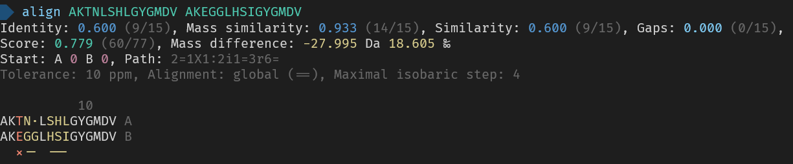
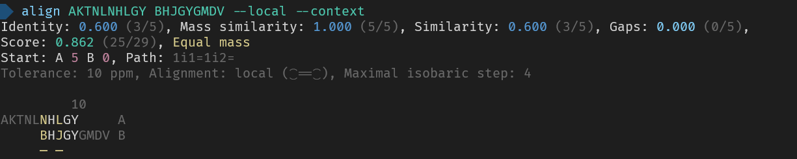
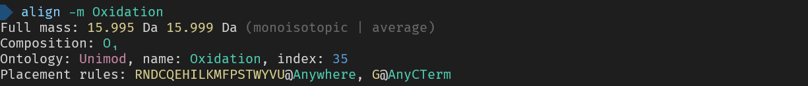
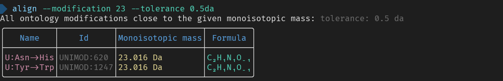
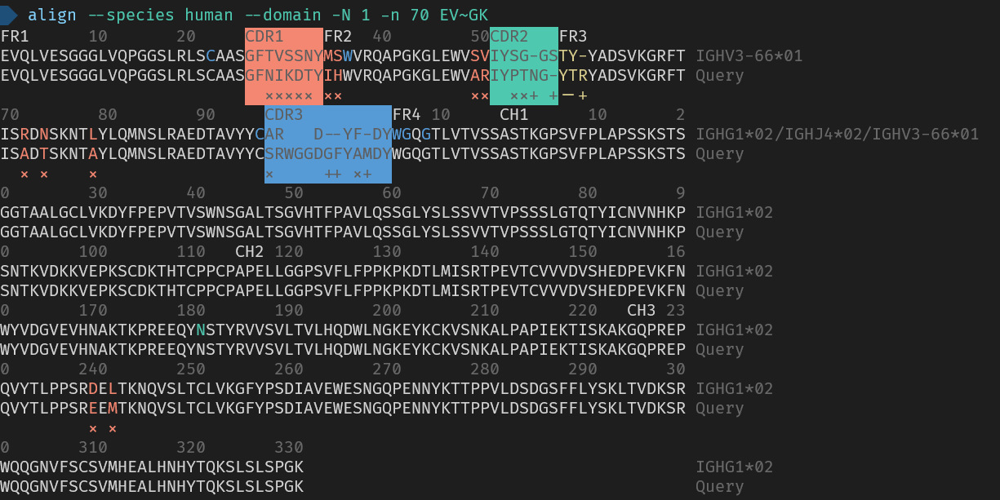

# Align-cli

A tool to help your manual mass spec inspection workflow. With alignments, isobaric sequences, and other mass spec information.

## How to install

1. Pick the correct binary for your machine in the release
2. Place it in a nice location on your machine
3. If you are using a unix-based operating system (linux or mac) do not forget to `chmod +x <binary>`
4. Open a terminal and use the tool
5. If you want you can add the location of the binary to your path, this makes it so that you can use it across your whole machine


[More elaborate instructions for Windows (installing another program)](https://www.dyingtowrite.com/posts/2021/27_how-to-install-cli-manually-windows/)

### How to install from source

1. First install [Rust](https://www.rust-lang.org/tools/install).
2. Install the tool using cargo (part of Rust) `cargo install align-cli`
3. Use!

## Quick usage overview

1. Pairwise alignment
   - Align two sequences `align <A> <B>`, this shows the best alignment for these two sequences.
   - Align a single peptide to a database `align <A> --file <FILE.fasta>`.
   - Align a single peptide to the IMGT database `align <A> --imgt`.
   - Align a single peptide to the V-J-C domains in the IMGT database `align <A> --domain`.
   - Align a single peptide to a specific gene in IMGT database `align <A> --specific-gene <GENE>`.
   - For any of these you can control if the peptides have to allign fully (`--global`), if you want to see the best possible subsequence alignment (`--local`), or a more elaborate mode (see `--help` and `--type`).
2. Get information about a single sequence `align <sequence>`, this shows many basic properties (like mass) and generates isobaric sequences to this sequence.
   - Use `--fixed <MODIFICATIONS>` and `--variable <MODIFICATIONS>` to fine tune the generated isobaric sequences.
3. Get information about a single modification `align --modification <MODIFICATION>`.
   - Use a full name to list its properties eg `--modification Oxidation`
   - Use a formula to find all modifications with that formula eg `--modification Formula:O`
   - Use a mass to find all modifications with that mass eg `--modification +15.995`
4. List IMGT genes `align --imgt` or `align --specific-gene <GENE>`.

For all additional options and more description use `align --help`.

## Example usage







_Here are the used commands for reference_
```
> align AKTNLSHLGYGMDV AKEGGLHSIGYGMDV
> align AKTNLNHLGY BHJGYGMDV --local --context
> align GAI
> align --modification 23 --tolerance 0.5da
> align -m Oxidation
> align --species human --domain -N 1 -n 70 EVQLVESGGGLVQPGGSLRLSCAASGFNIKDTYIHWVRQAPGKGLEWVARIYPTNGYTRYADSVKGRFTISADTSKNTAYLQMNSLRAEDTAVYYCSRWGGDGFYAMDYWGQGTLVTVSSASTKGPSVFPLAPSSKSTSGGTAALGCLVKDYFPEPVTVSWNSGALTSGVHTFPAVLQSSGLYSLSSVVTVPSSSLGTQTYICNVNHKPSNTKVDKKVEPKSCDKTHTCPPCPAPELLGGPSVFLFPPKPKDTLMISRTPEVTCVVVDVSHEDPEVKFNWYVDGVEVHNAKTKPREEQYNSTYRVVSVLTVLHQDWLNGKEYKCKVSNKALPAPIEKTISKAKGQPREPQVYTLPPSREEMTKNQVSLTCLVKGFYPSDIAVEWESNGQPENNYKTTPPVLDSDGSFFLYSKLTVDKSRWQQGNVFSCSVMHEALHNHYTQKSLSLSPGK
```
