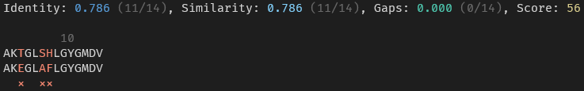

# Pairwise sequence alignment

A simple pairwise sequence alignment CLI.

## Usage
```
A command line interface for easily aligning two sequences.

Usage: align [OPTIONS] <X> <Y>

Arguments:
  <X>  First sequence
  <Y>  Second sequence

Options:
  -g, --global                   Use global alignment, default
  -s, --semi-global              Use semi-global alignment
  -l, --local                    Use local alignment
  -m, --mass                     Use mass alignment, interpreting the sequences as ProForma
  -n, --line-width <LINE_WIDTH>  The number of characters to show on a single line in the alignment [default: 50]
  -h, --help                     Print help
  -V, --version                  Print version
```

## How to install 

1. First install [Rust](https://www.rust-lang.org/tools/install).
1. Install the tool using cargo (part of Rust) `cargo install align-cli`
1. Use! `align ANA AGGA -m`

## Example usage
```
AKTGLSHLGYGMDV AKEGLAFLGYGMDV
```

