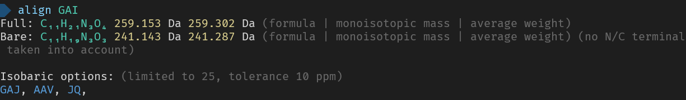

# Pairwise sequence alignment

A tool to help your manual mass spec inspection workflow. With alignments, isobaric sequence, and other mass spec information.

## Usage

1. Align two sequences `align <X> <Y>`, this shows the best alignment for these two sequences.
1. Align a single peptide to a database `align <X> --file <FILE.fasta>`, this shows the scores for the best matches for this peptide alongside the alignment for the best match.
1. Get information about a single sequence `align <sequence>`, this shows many basic properties (like mass) and generates isobaric sequences to this sequence.
1. Get information about a single modification, `align --modification <MODIFICATION>`, this shows basic properties, and if it is a mass shift, eg `+58.01`, it shows all modifications that have the same mass within the tolerance.

For all additional options and more description use `align --help`.

## How to install 

1. First install [Rust](https://www.rust-lang.org/tools/install).
1. Install the tool using cargo (part of Rust) `cargo install align-cli`
1. Use! `align ANA AGGA`

## Example usage
```
align AKTNLSHLGYGMDV AKEGGLHSIGYGMDV
```

```
align GAI
```

```
align --modification +58.01 --tolerance 0.05da
```
